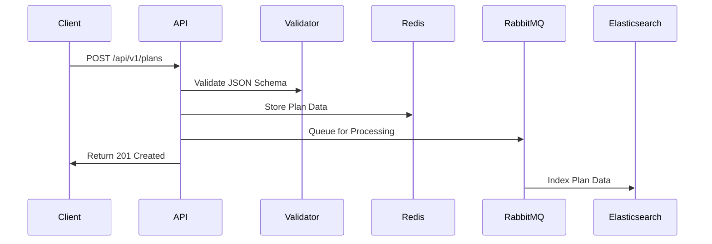
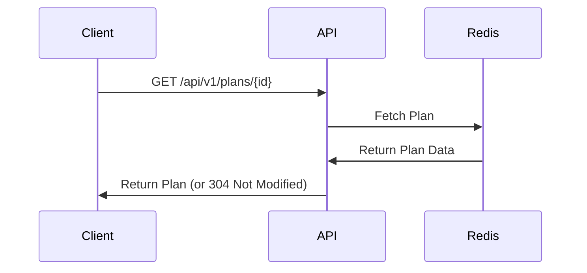
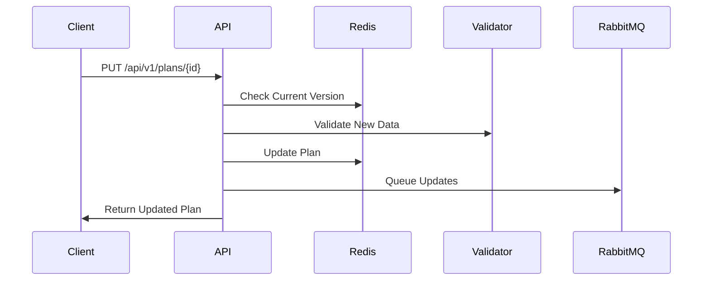
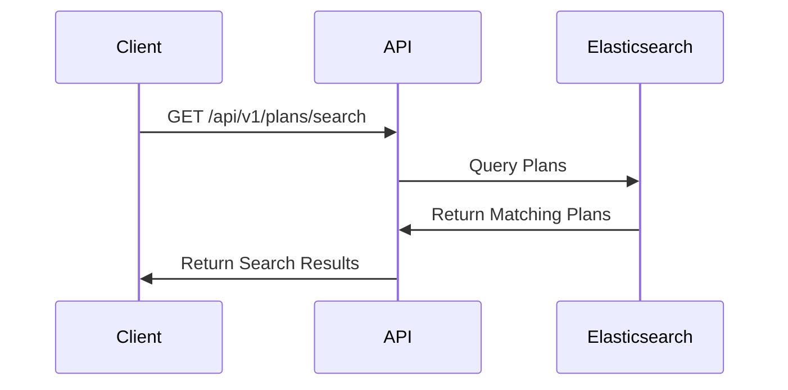
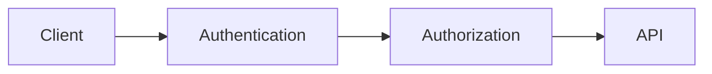

# System Architecture and Workflow

## 1. Core Components

### 1.1 Redis Cache/Database
- Acts as the primary storage system
- Stores plan data in JSON format
- Enables fast retrieval and caching
- Structure of stored data:
  ```json
  {
    "data": {
      // actual plan data
    },
    "metadata": {
      "created_by": "username",
      "created_at": "timestamp",
      "updated_by": "username",
      "updated_at": "timestamp"
    },
    "etag": "md5hash"
  }
  ```

### 1.2 Elasticsearch
- Powers the search functionality
- Indexes plan data for efficient searching
- Enables complex queries on plan attributes

### 1.3 RabbitMQ
- Message queue for asynchronous operations
- Handles background processing of plan data
- Ensures system scalability

## 2. Request Flow

### 2.1 Creating a Plan (POST Request)


1. Client sends a POST request with plan data
2. System validates the JSON against schema
3. Generates an ETag (MD5 hash of plan data)
4. Creates metadata with timestamp and user info
5. Stores in Redis
6. Queues to RabbitMQ for background processing
7. Returns success response with location header

### 2.2 Retrieving a Plan (GET Request)


1. Client requests plan with ID
2. System checks Redis for plan
3. If ETag matches (If-None-Match header), returns 304
4. Otherwise returns full plan data

### 2.3 Updating a Plan (PUT Request)


1. Client sends PUT request with new plan data
2. System validates If-Match header against current ETag
3. Validates new JSON data
4. Updates plan in Redis with new ETag
5. Queues changes for background processing
6. Returns updated plan

### 2.4 Searching Plans


1. Client sends search query with parameters
2. System queries Elasticsearch
3. Returns matching plans

## 3. Data Validation and Security

### 3.1 JSON Schema Validation
- Every plan must conform to predefined schema
- Validates:
  - Required fields
  - Data types
  - Field formats
  - Nested object structure

### 3.2 Security Measures


- Authentication required for all endpoints
- User information tracked in metadata
- ETag-based concurrency control
- Secure headers and responses

## 4. Error Handling

The system handles various error scenarios:

1. **Validation Errors** (400)
   - Invalid JSON format
   - Schema validation failures

2. **Authentication Errors** (401)
   - Missing or invalid credentials

3. **Not Found Errors** (404)
   - Plan ID doesn't exist

4. **Concurrency Errors** (412)
   - ETag mismatch during updates

5. **Server Errors** (500)
   - Internal processing failures

## 5. Asynchronous Processing

The RabbitMQ integration enables:
1. Background indexing in Elasticsearch
2. Async data processing
3. System scalability
4. Reduced response times

## 6. Caching Strategy

The system implements a sophisticated caching strategy:
1. ETag generation for all plans
2. Conditional requests support
3. Redis as cache layer
4. Cache invalidation on updates

## 7. API Endpoints Summary

1. `POST /api/v1/plans`
   - Create new plans
   - Returns Location header and ETag

2. `GET /api/v1/plans/{id}`
   - Retrieve plans
   - Supports conditional requests

3. `PUT /api/v1/plans/{id}`
   - Full plan updates
   - Requires If-Match header

4. `PATCH /api/v1/plans/{id}`
   - Partial plan updates
   - Deep merging support

5. `DELETE /api/v1/plans/{id}`
   - Remove plans
   - Cascading deletions

6. `GET /api/v1/plans/search`
   - Search functionality
   - Multiple search parameters

This system is designed with scalability, reliability, and performance in mind. It uses modern architectural patterns and best practices to ensure robust plan data management while maintaining data consistency and providing fast access to information.
